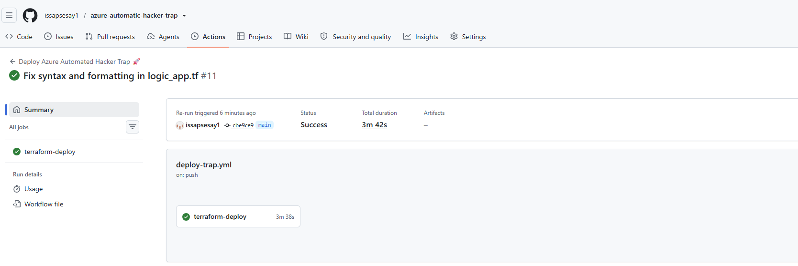
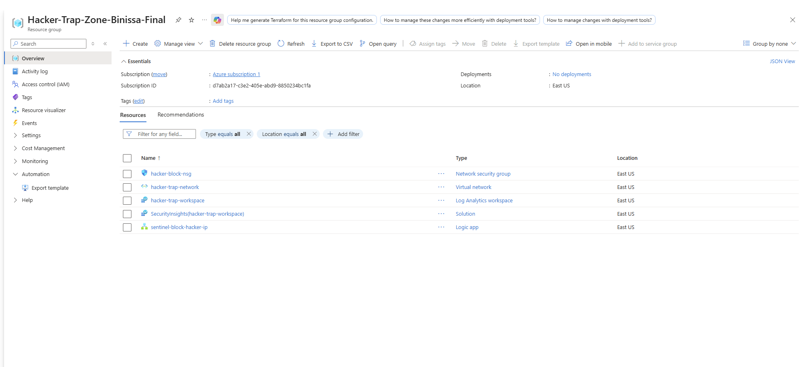

markdown
# Azure SOAR Framework: Automated Threat Detection & Incident Response

## Architectural Overview
This repository contains a production-ready **Security Orchestration, Automation, and Response (SOAR)** architecture. It is built as Security-as-Code (SaC) via Terraform and deployed using a GitHub Actions CI/CD pipeline.

The project demonstrates how to ingest live security telemetry, analyze network attack patterns, and execute real-time, automated incident response to contain active perimeter threats without manual human intervention.

## Automated Incident Response Lifecycle
1. **Detection (SIEM Engineering):** Microsoft Sentinel continuous collection patterns query brute-force anomalies across infrastructure event logs.
2. **Orchestration (SOAR Playbook):** Sentinel correlates the attack event and triggers a responsive **Azure Logic App workflow** (`logic_app.tf`) via an automated HTTP schema trigger.
3. **Mitigation (Inline Isolation):** The automated playbook parses the metadata, extracts the attacker's remote IP address, and programmatically pushes an active inbound Drop rule directly onto the network firewall (Network Security Group), isolating the vector instantly.

## Tech Stack & Compliance Reference
- **Infrastructure Framework:** Terraform (HashiCorp `azurerm` provider)
- **Automation Pipeline Engine:** GitHub Actions CI/CD Framework
- **Security Control Alignment:** NIST SP 800-61 (Computer Security Incident Handling Guide)

##  Verification & Operational Proof

###  1. Automated Pipeline Deployment Success
This evidence verifies that the GitHub Actions automation runner securely logs into the Microsoft Cloud tenant via authorized service principal connections and provisions the monitoring framework cleanly via Terraform.
Run Verified: Update main.tf (Status: Success) - Hacker-Trap-Zone-Binissa-Final Deployed

###  2. Programmatic Perimeter Injection (Cloud Resource Verification)
This verification snapshot confirms that the infrastructure-as-code automation successfully provisioned the Microsoft Sentinel analytics workspace, core network spaces, and target firewall network security groups directly inside the live Azure subscription tenant.

